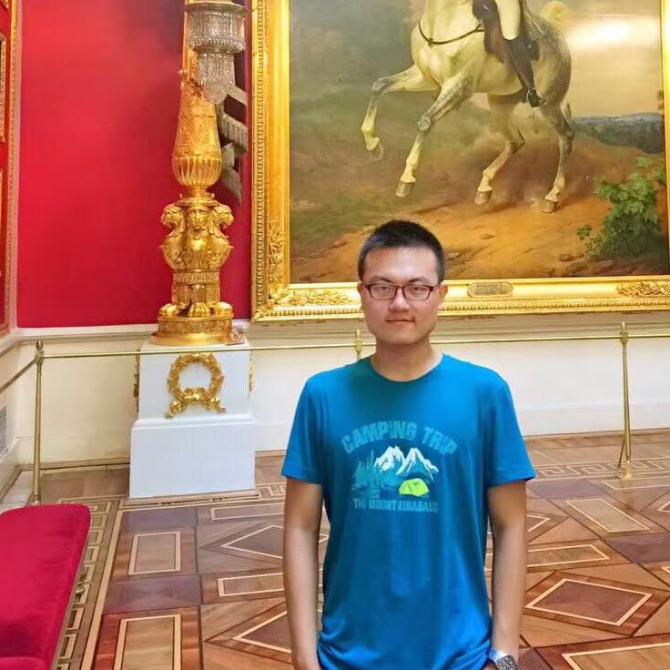

## About Me

Hi! I am a senior year student of B.E. Electrical Engineering at Xi'an Jiaotong University, China.

This site is built to show my basic academic information and experiences.

## Research Interest

> VLSI Design, Computer Architecture, Machine Learning

## Education

Year | Institute | Major |Focus
-----|-------|--------|--------
2015 - 2019 | [Xi'an Jiaotong University](http://en.xjtu.edu.cn/)  | B.Eng in Electrical Engineering | VLSI & Computer Architecture
2019 - 2021 | [Swiss Federal Institute of Technology at Zurich](https://www.ethz.ch/) | M.Sc in Biomedical Engineering | VLSI & Bioinformatics & Machine Learning

## Honors

1. Undergraduate Internship Scholarship, 2018 (CSC & MITACS Canada)
2. Samsung Schorlorship, 2017 (Samsung Corporation & Xi'an Jiaotong University)
3. Excellent Student Award, 2016-2018 (Xi'an Jiaotong University)
4. Siyuan Scholarship, 2016-2017 (Xi'an Jiaotong University)

---

## References

Responce upon request.
